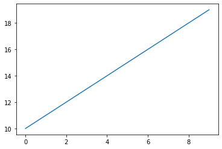
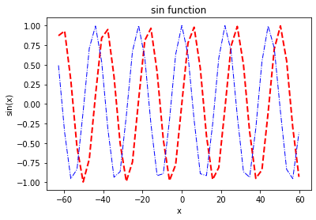
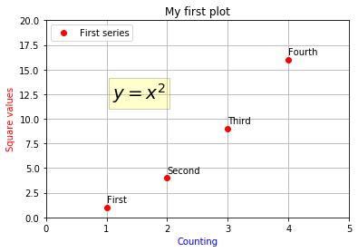
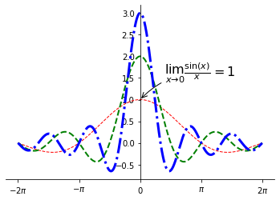
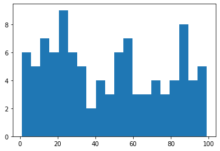
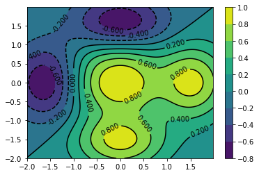
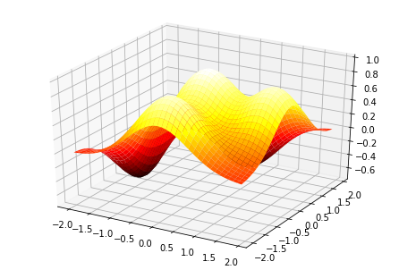
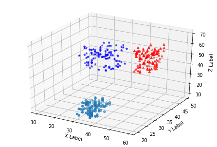
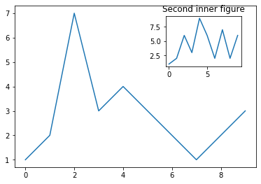
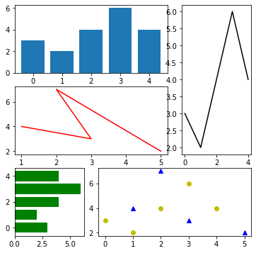

```python
import matplotlib.pyplot as plt

x_list = [x for x in range(10)]
y_list = [y for y in range(10,20)]

plt.plot(x_list,y_list)
plt.show()

```





```python
import matplotlib.pyplot as plt
import numpy as np

x = np.arange(-20*np.pi,20*np.pi,np.pi)
y1 = np.sin(2*np.pi*x)
y2 = np.cos(2*np.pi*x)

#plt.subplot(211)#子图
plt.title("sin function")
plt.xlabel("x")
plt.ylabel("sin(x)")
plt.plot(x,y1,"b--",color = 'red',linewidth = 2)#函数图像的形状
plt.plot(x,y2,"r-.",color = 'blue',linewidth = 1)#函数图像的形状
plt.show()#显示绘制的图像
```





```python
#为图表添加信息
#plt.text(x,y,string,fontdict = None.**kwargs)

import matplotlib.pyplot as plt

plt.axis([0,5,0,20]) #x y轴的取值范围
plt.title("My first plot")
plt.xlabel("Counting",color = 'blue')
plt.ylabel("Square values",color = "red")

#在图标任意位置添加文本
plt.text(1,1.5,"First")
plt.text(2,4.5,"Second")
plt.text(3,9.5,"Third")
plt.text(4,16.5,"Fourth")

#添加描述图形个数据点的趋势的公式
plt.text(1.1,12,r'$y=x^2$',fontsize = 20,bbox = {'facecolor':'yellow','alpha':0.2})

#添加网格
plt.grid()

#画图
plt.plot([1,2,3,4],[1,4,9,16],'ro')

#添加图例 默认添加到右上角
plt.legend(["First series"],loc = 2)

#将图表保存为图片
plt.savefig("first.png")

```





```python
#线性图
import matplotlib.pyplot as plt
import numpy as np

x = np.arange(-2*np.pi,2*np.pi,0.01)
y1 = np.sin(1*x)/x
y2 = np.sin(2*x)/x
y3 = np.sin(3*x)/x

plt.plot(x,y1,'k--',linewidth = 1,color = 'red')
plt.plot(x,y2,'k--',linewidth = 2,color = 'green')
plt.plot(x,y3,'m-.',linewidth = 3,color = 'blue')

#数值范围写成-2π---2π
#plt.xticks([],[]) 传入两个列表，第一个列表存储刻度的位置，第二个列表存储刻度的标签
plt.xticks([-2*np.pi,-np.pi,0,np.pi,2*np.pi],[r'$-2\pi$',r'$-\pi$',r'$0$',r'$\pi$',r'$2\pi$'])

#为图像添加注释
plt.annotate(r'$\lim_{x\to 0}\frac{\sin(x)}{x}=1$',xy=[0,1],xycoords='data',
            xytext=[30,30],fontsize = 16,textcoords = 'offset points',
            arrowprops = dict(arrowstyle = '->',connectionstyle = 'arc3,rad=.2'))

#图像的笛卡尔坐标轴
ax = plt.gca()
ax.spines['right'].set_color('none')
ax.spines['top'].set_color('none')
ax.xaxis.set_ticks_position('bottom')
ax.spines['right'].set_position(("data",0))
ax.yaxis.set_ticks_position('left')
ax.spines['left'].set_position(("data",0))

plt.show()
```





```python
#直方图
import matplotlib.pyplot as plt
import numpy as np

#生成0,到100 间的100个随机整数 
pop = np.random.randint(0,100,100)

#绘制直方图
n,bins,patches = plt.hist(pop,bins = 20)

plt.show()

```





```python
#条状图

```


```python
#饼图
#plt.pie()函数生成 饼图

import matplotlib.pyplot as plt
import numpy as np

#每部分的标题
labels = ['Nokia','Samsung','Apple','Lumia']

#每一部分的数值
values = [10,30,45,15]

#每一部分的颜色
colors = ['red','green','blue','yellow']

#突出显示某一部分 ,需要使用 explode 关键字参数，范围0-1
explode = [0.3,0,0,0]

#调整饼图的旋转角度startangle 0-360

#添加阴影效果 shadow = True

#使用autopct关键字参数，在每一块的中间位置添加文本标签来显示百分比

#添加标题title
plt.title("A pie of Phone")

#制作饼图
plt.pie(values,labels = labels,colors = colors,explode = explode,
       shadow = True,autopct = '%1.1f%%',startangle = 170)


#为了绘制标准的圆形饼图，需调用axis函数
plt.axis("equal")

plt.show()

```


```python
#等值(高)线图    
#plt.contour()函数生成三维结构表面的等值线图
import matplotlib.pyplot as plt
import numpy as np

#首先需要用z=f(x,y）函数生成三维结构
#然后定义x,y的取值范围，确定要现实的区域
#然后使用f(x,y)函数计算每一对（x,y）所对应的z值，得到一个z值矩阵。
#最后用 plt.contour()函数生成三维结构表面的等值线图

dx = 0.01
dy = 0.01

x = np.arange(-2.0,2.0,dx)
y = np.arange(-2.0,2.0,dy)
#记得查百度找注释
X,Y = np.meshgrid(x,y)

def f(x,y):
    return (1 - y**5 + x**5)*np.exp(-x**2-y**2)

C = plt.contour(X,Y,f(X,Y),8, colors = 'black')
plt.contourf(X,Y,f(X,Y),8)#,cmap = plt.cm.hot
plt.clabel(C,inline = 1 ,fontsize = 10)

#增加图例对照表
plt.colorbar()

plt.show()

```





```python
#3D 曲面 plot_surface()   


from mpl_toolkits.mplot3d import Axes3D
import matplotlib.pyplot as plt
import numpy as np


fig = plt.figure()
ax = Axes3D(fig)
x = np.arange(-2,2,0.1)
y = np.arange(-2,2,0.1)

X,Y = np.meshgrid(x,y)

def f(x,y):
    return (1 - y**5 + x**5)*np.exp(-x**2-y**2)

#绘制曲面图
ax.plot_surface(X,Y,f(X,Y),rstride = 1,cstride = 1,cmap = plt.cm.hot)

#视角设置
ax.view_init(elev = 30 ,azim = 125)

```


    <mpl_toolkits.mplot3d.art3d.Poly3DCollection at 0x1f4e202cd48>





```python
#3D 散点图
from mpl_toolkits.mplot3d import Axes3D
import matplotlib.pyplot as plt
import numpy as np

xs1 = np.random.randint(30,40,100)
ys1 = np.random.randint(20,30,100)
zs1 = np.random.randint(10,20,100)

xs2 = np.random.randint(50,60,100)
ys2 = np.random.randint(30,40,100)
zs2 = np.random.randint(50,70,100)

xs3 = np.random.randint(10,30,100)
ys3 = np.random.randint(40,50,100)
zs3 = np.random.randint(30,50,100)

fig = plt.figure()

ax = Axes3D(fig)
ax.scatter(xs1,ys1,zs1)
ax.scatter(xs2,ys2,zs2,c = 'r',marker = "^")
ax.scatter(xs3,ys3,zs3,c = 'b',marker = "*")

ax.set_xlabel("X Label")
ax.set_ylabel("Y Label")
ax.set_zlabel("Z Label")

plt.show()
```





```python
# 多面板图形

#在其他子图中显示子图  add_axes()

import matplotlib.pyplot as plt

fig = plt.figure()

ax = fig.add_axes([0.1,0.1,0.8,0.8])

inner_ax = fig.add_axes([0.6,0.6,0.25,0.25])

x1 = np.arange(10)
y1 = np.array([1,2,7,3,4,3,2,1,2,3])
x2 = np.arange(10)
y2 = np.array([1,2,6,3,9,6,2,7,2,6])

plt.title("First figure")
ax.plot(x1,y1)

plt.title("Second inner figure")
inner_ax.plot(x2,y2)


plt.show()
```





```python
#子图网格  GridSpec（） 管理更加复杂的子图分布情况
import matplotlib.pyplot as plt
import numpy as np

gs = plt.GridSpec(3,3)

fig = plt.figure(figsize=(6,6))

x1 = np.array([1,3,2,5])
y1 = np.array([4,3,7,2])
s1 = fig.add_subplot(gs[1,:2])
s1.plot(x1,y1,"r")

x2 = np.arange(5)
y2 = np.array([3,2,4,6,4])
s2 = fig.add_subplot(gs[0,:2])
#条状图
s2.bar(x2,y2)

s3 = fig.add_subplot(gs[2,0])
#水平条状图
s3.barh (x2,y2,color = 'g')


s4 = fig.add_subplot(gs[:2,2])
#常规折线图
s4.plot(x2,y2,"k")


s5 = fig.add_subplot(gs[2,1:])
s5.plot(x1,y1,"b^",x2,y2,"yo")

plt.show()

```





```python

```
